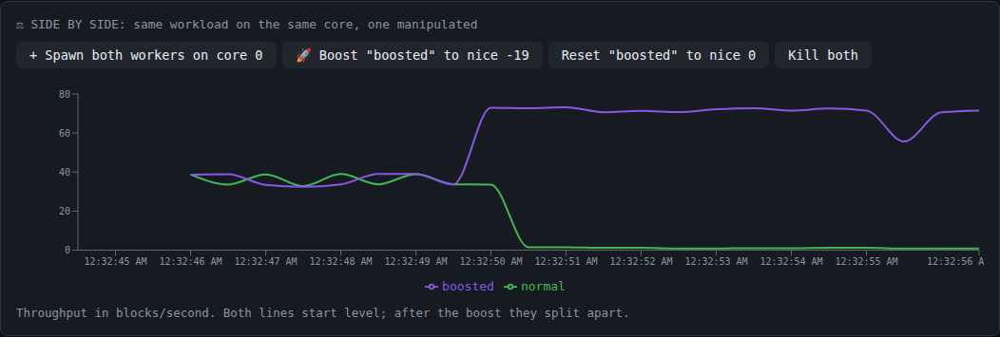
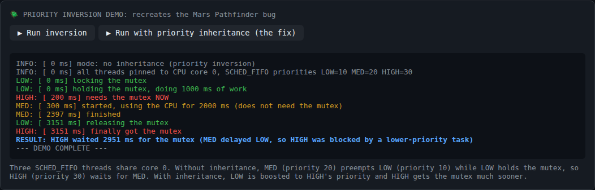
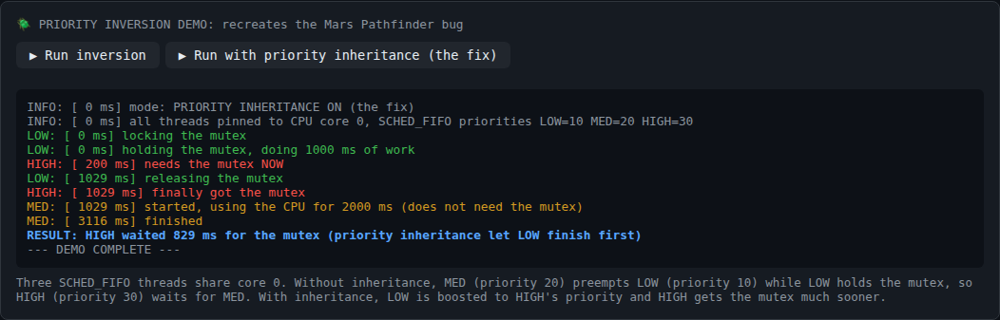

# Scheduler Manipulator: Cheat the OS

A real-time tool that **manipulates the Linux kernel's CPU scheduler on a live system** and shows the effect on a web dashboard. It changes process priorities, pins processes to CPU cores, and recreates a genuine **priority inversion** (the bug that kept resetting NASA's Mars Pathfinder) with real-time threads, then fixes it with **priority inheritance**.

> Group project for the **Operating Systems** course, Department of Cyber Security, Air University Islamabad. The full project [report](docs/Scheduler_Manipulator_Report.pdf) and [presentation](docs/Scheduler_Manipulator_Presentation.pptx) are in `docs/`.



## ✨ The Five Modes

| Mode | What it does | Linux mechanism |
|---|---|---|
| 👁 **Observe** | Live process table every 500 ms: PID, nice, CPU %, allowed cores, status, worker throughput | `/proc` via `psutil` |
| 🚀 **Inflate** | Raises a worker's priority to nice -15 | `renice` → `setpriority()` |
| 💀 **Starve** | Pins workers to CPU core 0 so they fight over one CPU while other cores sit idle | `taskset` → `sched_setaffinity()` |
| 🪲 **Inversion** | Real priority inversion with three `SCHED_FIFO` threads, plus a run with priority inheritance | pthreads, `sched_setscheduler()`, `PTHREAD_PRIO_INHERIT` |
| ⚖ **Compare** | Two identical workers on the same core; boost one and watch the throughput lines split apart | `taskset` + `renice` |

**Restore** puts a worker back to nice 0, the normal `SCHED_OTHER` policy (`chrt -o`) and all cores.

## 📊 Measured Results

Measured on a 2-core Linux machine (throughput in blocks/second; exact numbers depend on the CPU):

| Experiment | Result |
|---|---|
| Two free workers → both pinned to core 0 | ~65 each → ~36 each |
| Both on core 0, one reniced to -15 | 68 vs 2.5 |
| Compare: "boosted" set to nice -19 | 36 / 35 before → **67 vs 1.1** after |
| Priority inversion (no inheritance) | HIGH waited **~2950 ms** for the mutex |
| Same scenario with `PTHREAD_PRIO_INHERIT` | HIGH waited **~800 ms** |

## 🪲 How the Priority Inversion Demo Works

`c/mutex_demo.c` pins itself to **one CPU core** and starts three real-time `SCHED_FIFO` threads:

| Thread | Priority | Does |
|---|---|---|
| LOW | 10 | Locks the mutex, needs 1000 ms of CPU inside the critical section |
| MED | 20 | Never touches the mutex, burns 2000 ms of CPU |
| HIGH | 30 | Needs the mutex |

Without inheritance, MED preempts LOW while LOW holds the lock, so **HIGH waits behind a lower-priority thread**. With `--inherit`, LOW is boosted to HIGH's priority the moment HIGH blocks, finishes its critical section, and HIGH gets the mutex almost immediately.

| Without inheritance | With priority inheritance |
|---|---|
|  |  |

## 🏗 Architecture

```
React dashboard (Vite, :5173)
        │  WebSocket  ws://localhost:5000/ws  (JSON commands / stats every 500 ms)
        ▼
Python backend (Flask + flask-sock, 127.0.0.1:5000)
        │  renice / taskset / chrt      starts and reads the C programs
        ▼
C programs: worker (CPU load + throughput), mutex_demo (inversion)
        │  setpriority · sched_setaffinity · sched_setscheduler · futex
        ▼
Linux kernel scheduler
```

## 🚀 Getting Started

Requires **Linux** (tested on Debian under WSL2), `gcc`, `make`, Python 3 and Node.js.

```bash
git clone https://github.com/talha-cybersec/Scheduler-Manipulator.git
cd Scheduler-Manipulator

# 1. Build the C programs
cd c && make && cd ..

# 2. Backend (needs root for negative nice values and real-time threads)
cd backend
python3 -m venv venv
venv/bin/pip install -r requirements.txt
sudo venv/bin/python app.py    # listens on 127.0.0.1:5000

# 3. Frontend (in a second terminal)
cd frontend
npm install
npm run dev                    # open http://localhost:5173
```

**Running the backend without `sudo`** (`venv/bin/python app.py`): the backend automatically retries privileged commands through `sudo -n`. Allow exactly these commands without a password (`sudo visudo -f /etc/sudoers.d/scheduler-manipulator`):

```
youruser ALL=(root) NOPASSWD: /usr/bin/renice, /usr/bin/taskset, /usr/bin/chrt, /full/path/to/c/mutex_demo
```

Without root or this rule, privileged actions fail and the dashboard shows the error in red.

## 📁 Project Structure

```
Scheduler-Manipulator/
├── c/
│   ├── worker.c          # CPU-bound workload, prints throughput
│   ├── mutex_demo.c      # real priority inversion (+ --inherit)
│   └── Makefile
├── backend/
│   ├── app.py            # Flask WebSocket server
│   ├── scheduler.py      # SchedulerManipulator: renice / taskset / chrt / psutil
│   └── requirements.txt
├── frontend/
│   ├── src/App.jsx       # the whole React dashboard
│   ├── src/main.jsx
│   └── package.json
└── docs/
    ├── Scheduler_Manipulator_Report.pdf
    ├── Scheduler_Manipulator_Presentation.pptx
    └── screenshots/
```

## 🔐 Security Notes

- The backend can change the priority of **any** process, so it binds to `127.0.0.1` only (override with `SM_HOST` at your own risk).
- Commands run through `subprocess.run` with argument lists, never a shell, and all PIDs, nice values and cores are converted to integers, so there is no command injection.
- Passwordless sudo, if used, is limited to the four commands the tool needs.
- Workers started by the dashboard are killed when the dashboard disconnects.

## 👥 Team

- **Muhammad Talha** · [@talha-cybersec](https://github.com/talha-cybersec)
- **Muhammad Ali**
- **Haseeb Ahsan**
